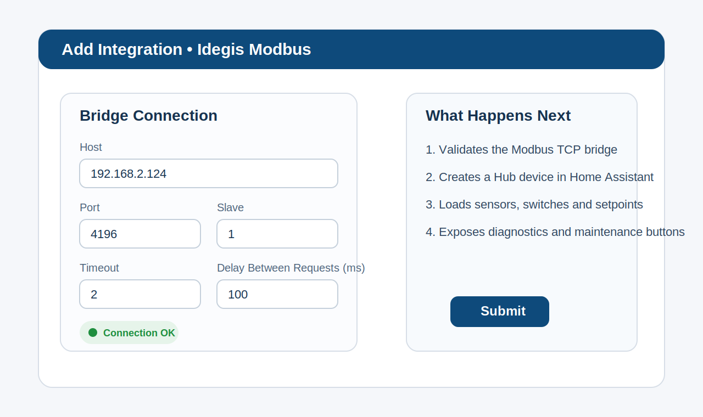
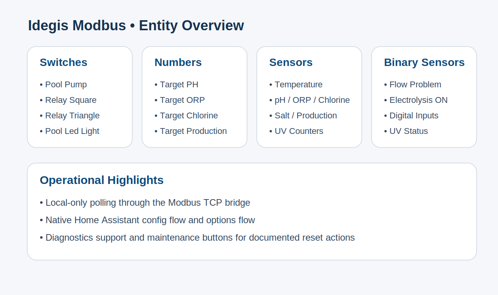
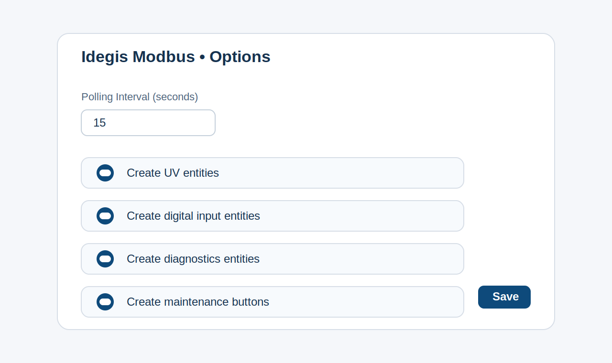

# Idegis Modbus for Home Assistant

Local Home Assistant custom integration for Idegis pool controllers over a Modbus TCP bridge.

This project was built to replace large manual YAML Modbus definitions with a native Home Assistant integration that can be installed through HACS and configured from `Settings -> Devices & Services`.

It targets devices such as the Idegis Domotic 2 LS and exposes:

- relay switches
- relay state binary sensors
- pH, ORP, free chlorine, temperature and salt sensors
- editable target numbers for pH, ORP, chlorine and electrolysis production
- UV status, availability and lifetime counters
- digital inputs
- maintenance buttons for documented reset actions
- diagnostics support for troubleshooting

## Highlights

- Native UI setup with `Config Flow`
- HACS-installable custom integration
- Native `number` entities for setpoints
- Single coordinated Modbus polling path
- Local-only operation, no cloud required
- Options flow to enable or disable UV, inputs, diagnostics and maintenance buttons
- Diagnostics dump with raw Modbus register snapshots

## Screenshots

### Config flow



### Entity overview



### Options flow



## Installation

### Install with HACS

1. Open HACS in Home Assistant.
2. Go to `Integrations`.
3. Open the menu in the top right and choose `Custom repositories`.
4. Add this repository URL:

   `https://github.com/julianbl/IdegisModbus`

5. Select category `Integration`.
6. Install `Idegis Modbus`.
7. Restart Home Assistant.

### Manual installation

Copy `custom_components/idegis_modbus` into your Home Assistant `custom_components` directory and restart Home Assistant.

## Setup

After Home Assistant restarts:

1. Go to `Settings -> Devices & Services`.
2. Click `Add Integration`.
3. Search for `Idegis Modbus`.
4. Enter:
   - bridge host
   - bridge port
   - Modbus slave
   - timeout
   - delay between Modbus requests

The integration validates the bridge before creating the config entry.

## Options

The options flow lets you control:

- polling interval
- whether UV entities are created
- whether digital input entities are created
- whether diagnostics entities are created
- whether maintenance buttons are created

## Exposed entities

### Switches

- Pool Pump
- Relay Square
- Relay Triangle
- Pool Led Light

### Numbers

- Target PH
- Target ORP
- Target Free Chlorine
- Target Electrolysis Production

### Sensors

- Water Temperature
- Salt Concentration
- Current PH
- Current ORP
- Current Free Chlorine
- Electrolysis Production
- Cell Current
- Cell Voltage
- Instant Chlorine Production
- UV counters
- Electrolysis counters

### Binary sensors

- Electrolisys ON
- Water Flow Problem
- Digital Input 1..4
- Relay state feedback
- UV status and UV alarms

### Buttons

- Reset Partial Electrolysis Hours
- Reset PH Pumpstop
- Reset CL Pumpstop
- Restart PH Dose
- Restart CL Dose
- Reset UV Hours And Ignitions

## Architecture Notes

- Relay writes use `read-modify-write` so schedule-related bits are preserved.
- The integration polls register blocks instead of individual entities, which reduces queue pressure compared with large YAML Modbus setups.
- Setpoints are exposed as native `number` entities instead of `input_number + automation` workarounds.
- Diagnostics expose the raw input and holding registers gathered by the coordinator.

## Repository layout

- `custom_components/idegis_modbus`: integration code
- `tests`: unit tests
- `docs/images`: README screenshots
- `20210723 Tabla modbus 1.63.xlsm` and `IDEGIS modbus v1.3.0 ES (1).pdf`: source documentation used for reverse engineering and mapping

## Development

Useful commands:

```bash
python3 -m compileall custom_components/idegis_modbus
pytest
```

## Disclaimer

This integration is based on reverse engineering, Idegis Modbus tables and field validation against real hardware behavior. Validate every write action carefully on your own equipment before relying on it in production pool automations.
